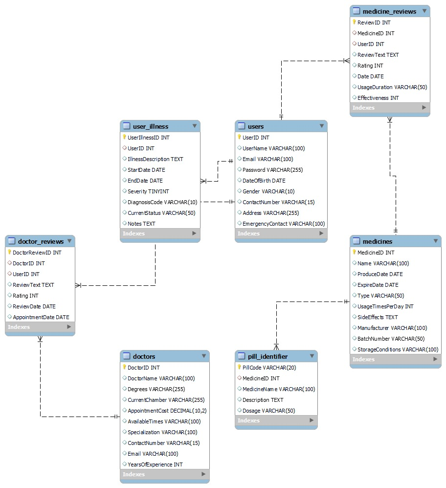
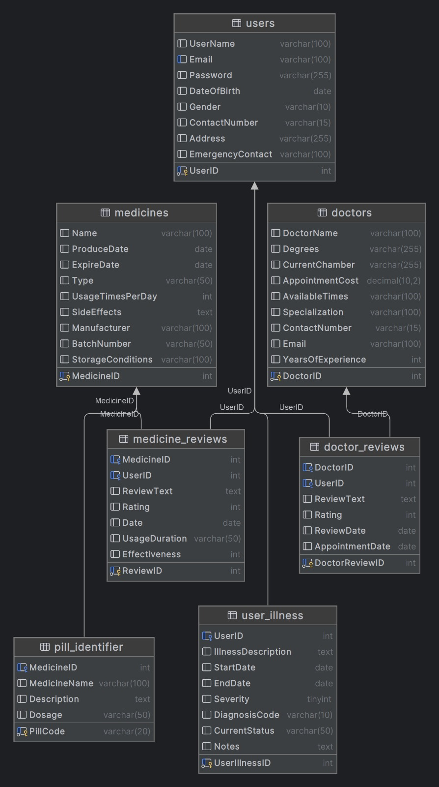

# Medication Management System (MediGuide)

MediGuide is a full-stack medication management platform that helps users:

- manage medicine inventory
- create medication plans and schedules
- track taken, missed, and skipped doses
- monitor adherence and summary reports
- check known medicine interactions
- discover nearby doctors

## Tech Stack

- Frontend: React + TypeScript + Vite
- Backend: Node.js + Express + Sequelize
- Database: MySQL
- Auth: JWT + bcrypt

## Organized Project Structure

```text
medication-management-system/
	frontend/
		src/
			components/
				common/
				layout/
			data/
			features/
				auth/
				dashboard/
				medicines/
				schedule/
				tracking/
				interactions/
				doctors/
				reports/
				settings/
			types/
	backend/
		src/
			config/
			controllers/
			middleware/
			models/
			routes/
			utils/
```

## Frontend Pages

- Login
- Register
- Dashboard
- Medicine Catalog
- Schedule Management
- Adherence Tracking
- Interaction Checker
- Doctors Directory
- Reports
- Settings

## Backend API Modules

- Auth: register, login, profile
- Medicines: full CRUD + search
- Plans: full CRUD for medication schedules
- Dose Logs: create and list logs
- Reminders: create and list reminders
- Interactions: check known interactions
- Doctors: list and create profiles
- Reports: summary adherence report

## Setup

### 1. Backend

```bash
cd backend
cp .env.example .env
npm install
npm run start
```

### 2. Frontend

```bash
cd frontend
npm install
npm run dev
```

## Environment Variables

Use values from backend/.env.example:

- PORT
- DB_HOST
- DB_NAME
- DB_USER
- DB_PASSWORD
- JWT_SECRET

## Diagrams

### ER Diagram


### Schema Diagram

